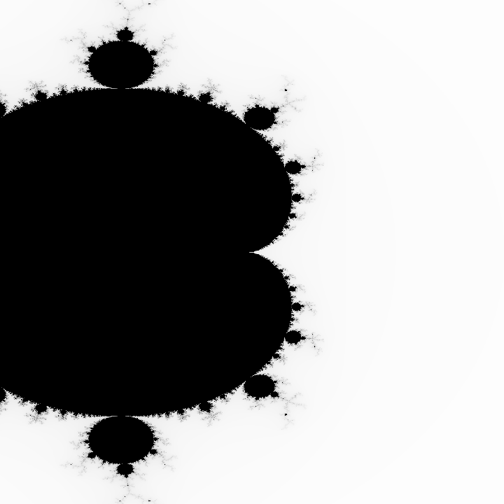
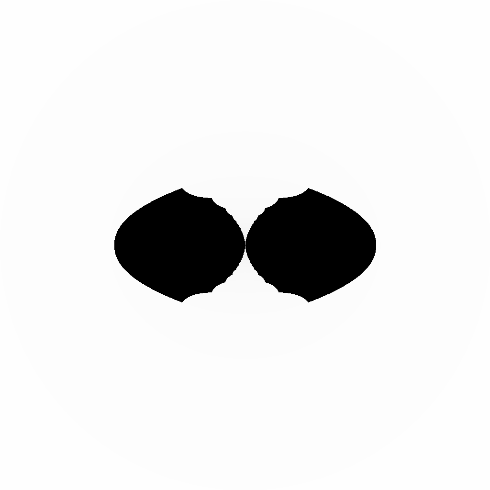
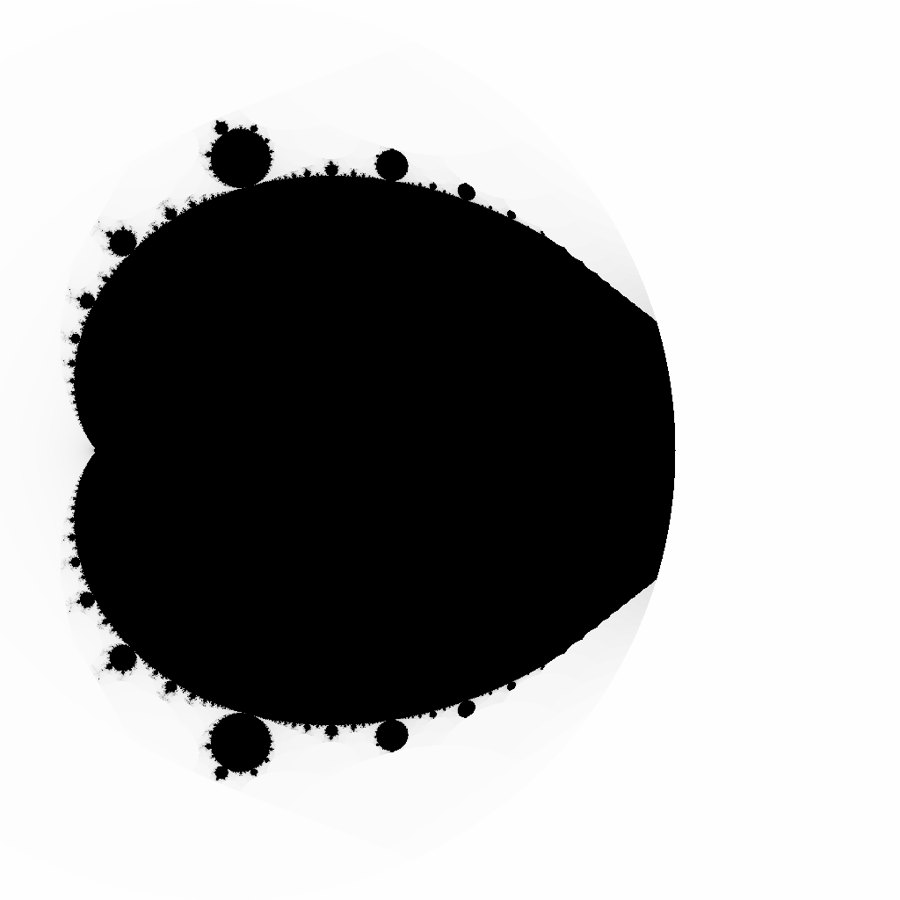

# Fractal Generator

A high-performance fractal visualization tool written in Rust that generates detailed zoom animations of various fractal types, including the Mandelbrot set, Julia sets, Burning Ship, and more.

## Features

- Generate high-resolution visualizations of multiple fractal types
- Create smooth zoom animations as GIF files
- Multi-threaded rendering for optimal performance
- Customizable parameters (resolution, coordinates, zoom factor, etc.)
- Command-line interface with sensible defaults
- Support for various fractal formulas

## Gallery

Here are some examples of the fractals that can be generated:

### Mandelbrot Set


### Julia Set


### Sin Fractal


### Cos Fractal


## Installation

### Prerequisites

- [Rust](https://www.rust-lang.org/tools/install) (2021 Edition or newer)
- Cargo (comes with Rust)

### Building from Source

Clone the repository and build with Cargo:

```bash
# Clone the repository
git clone https://github.com/yourusername/mandelbrot.git
cd mandelbrot

# Build in release mode for optimal performance
cargo build --release
```

The compiled binary will be available at `./target/release/mandelbrot`.

## Usage

Run the program with the default settings:

```bash
./target/release/mandelbrot
```

### Command Line Options

```bash
USAGE:
    mandelbrot [OPTIONS]

OPTIONS:
    -o, --output-folder <FOLDER>      Directory where output images and gif will be saved [default: results]
    -u, --upper-left <REAL,IMAG>      Upper left corner coordinates [default: -2.0,-1.0]
    -l, --lower-right <REAL,IMAG>     Lower right corner coordinates [default: 1.0,1.0]
    -s, --scale-factor <FACTOR>       Scaling factor for each frame (e.g., 0.9 for zoom in) [default: 0.95]
    -n, --n-frames <COUNT>            Number of frames to generate [default: 100]
    -d, --delay <DELAY>               Delay between frames in hundredths of a second [default: 15]
    -p, --pointer <REAL,IMAG>         The scale pointer for zooming [default: -1.4002,0.0]
    -j, --julia-constant <REAL,IMAG>  Constant for Julia sets [default: -0.8,0.156]
    -h, --help                        Print help information
    -V, --version                     Print version information
    --threads <COUNT>                 Number of threads to use for rendering [default: 8]
    --pixels <WIDTHxHEIGHT>           Image dimensions [default: 1024x1024]
    --power <POWER>                   Power for the fractal calculation [default: 2]
    --escape-radius <RADIUS>          Escape radius for the fractal calculation [default: 2.0]
    --no-frames                       Disable saving individual frames (only generate the final GIF)
    --fractal-type <TYPE>             The type of fractal to generate [default: mandelbrot]
                                      [possible values: mandelbrot, julia, burning-ship, tricorn, nova, sin, cos]
```

### Examples

Generate a 50-frame zooming animation at 800x600 resolution:

```bash
./target/release/mandelbrot --pixels 800x600 --n-frames 50 --no-frames
```

Zoom into a specific interesting region of the Mandelbrot set:

```bash
./target/release/mandelbrot --upper-left="-0.7436,-0.1262" --lower-right="-0.7396,-0.1222" --n-frames 100 --scale-factor 0.95
```

Generate a Julia set visualization:

```bash
./target/release/mandelbrot --fractal-type julia --julia-constant="-0.8,0.156"
```

Explore the Burning Ship fractal:

```bash
./target/release/mandelbrot --fractal-type burning-ship --upper-left="-2.0,-2.0" --lower-right="1.0,1.0"
```

Generate a Sin fractal with higher power:

```bash
./target/release/mandelbrot --fractal-type sin --power 3
```

Use more threads on a powerful system:

```bash
./target/release/mandelbrot --threads 16
```

## Recommended Zooming Points

Here are some interesting coordinates and zooming points for each fractal type that reveal beautiful structures:

### Mandelbrot Set

1. **Classic Bulb Border**

   ```bash
   --upper-left="-0.755,-0.1" --lower-right="-0.745,-0.09" --pointer="-0.75,-0.095"
   ```

   A zoom into the border between the main cardioid and the period-2 bulb.

2. **Seahorse Valley**

   ```bash
   --upper-left="-0.75,-0.15" --lower-right="-0.73,-0.13" --pointer="-0.745,-0.14"
   ```

   The seahorse valley contains beautiful spiral structures.

3. **Mini Mandelbrot**

   ```bash
   --upper-left="-1.8,-0.05" --lower-right="-1.7,0.05" --pointer="-1.75,0.0"
   ```

   Zoom into one of the mini Mandelbrot copies found throughout the set.

4. **Elephant Valley**
   ```bash
   --upper-left="0.27,0.485" --lower-right="0.3,0.515" --pointer="0.285,0.5"
   ```
   Named for structures resembling elephant trunks.

### Julia Sets

1. **Classic Julia**

   ```bash
   --fractal-type julia --julia-constant="-0.8,0.156" --pointer="0.0,0.0"
   ```

   A classic dendrite pattern.

2. **Spiral Julia**

   ```bash
   --fractal-type julia --julia-constant="-0.54,0.54" --upper-left="-1.0,-1.0" --lower-right="1.0,1.0" --pointer="0.0,0.0"
   ```

   Creates a beautiful spiral pattern.

3. **Dragon Julia**
   ```bash
   --fractal-type julia --julia-constant="-0.77,0.22" --pointer="0.0,0.0"
   ```
   A dragon-like pattern with intricate details.

### Burning Ship

1. **Central Structure**

   ```bash
   --fractal-type burning-ship --upper-left="-1.8,-0.09" --lower-right="-1.7,0.01" --pointer="-1.75,-0.04"
   ```

   The central "hull" of the burning ship.

2. **Mini Ships**
   ```bash
   --fractal-type burning-ship --upper-left="-1.69,-0.01" --lower-right="-1.71,0.01" --pointer="-1.7,0.0"
   ```
   Mini ship structures found within the fractal.

### Tricorn (Mandelbar)

1. **Main Structure**

   ```bash
   --fractal-type tricorn --upper-left="-2.0,-2.0" --lower-right="2.0,2.0" --pointer="0.0,0.0"
   ```

   The main tricorn structure with its three-fold symmetry.

2. **Spiral Detail**
   ```bash
   --fractal-type tricorn --upper-left="-0.31,-0.81" --lower-right="-0.29,-0.79" --pointer="-0.3,-0.8"
   ```
   Beautiful spiral patterns found within the tricorn.

### Nova Fractal

1. **Central Pattern**

   ```bash
   --fractal-type nova --upper-left="-0.1,-0.1" --lower-right="0.1,0.1" --pointer="0.0,0.0" --power 3
   ```

   The central pattern with power=3 showing the roots of unity.

2. **Complex Structure**
   ```bash
   --fractal-type nova --upper-left="-1.0,-1.0" --lower-right="1.0,1.0" --pointer="0.5,0.5" --power 4
   ```
   More complex structure with power=4.

### Sin Fractal

1. **Wave Pattern**

   ```bash
   --fractal-type sin --upper-left="-2.0,-2.0" --lower-right="2.0,2.0" --pointer="0.0,0.0"
   ```

   Shows the wave-like patterns characteristic of the sine function.

2. **Detail Zoom**
   ```bash
   --fractal-type sin --upper-left="-0.5,-0.5" --lower-right="0.5,0.5" --pointer="0.0,0.0"
   ```
   Zoom into more detailed structures.

### Cos Fractal

1. **Main Structure**

   ```bash
   --fractal-type cos --upper-left="-2.0,-2.0" --lower-right="2.0,2.0" --pointer="-1.73,0.0" --no-frames
   ```

   The overall structure of the cosine fractal.

2. **Interesting Region**
   ```bash
   --fractal-type cos --upper-left="-0.75,-0.75" --lower-right="0.75,0.75" --pointer="-1.73,0.0" --power 2
   ```
   An interesting region with power=2.

### Tips for Finding Your Own Interesting Points

1. **Start Wide**: Begin with a wider view (like `-2.0,-2.0` to `2.0,2.0`) to see the overall structure.

2. **Look for Boundaries**: The most interesting details are often found at the boundaries between the interior and exterior of the fractal.

3. **Adjust the Scale Factor**: For deeper zooms, use a scale factor closer to 1.0 (e.g., 0.98 or 0.99).

4. **Experiment with Power Values**: Changing the power parameter can dramatically alter the fractal's appearance.

5. **For Julia Sets**: Experiment with different constants to get entirely different fractals.

## How It Works

Fractals are complex mathematical objects that often exhibit self-similarity at different scales. This application implements different fractal types using iterative formulas:

### Supported Fractal Types

1. **Mandelbrot Set**

   ```math
   z_{n+1} = z_n^p + c, \text{ starting with } z_0 = 0
   ```

   The classic Mandelbrot set using powers (p) that can be adjusted.

2. **Julia Set**

   ```math
   z_{n+1} = z_n^p + k, \text{ starting with } z_0 = c
   ```

   Where k is a constant complex number and c is the complex coordinate of the point.

3. **Burning Ship**

   ```math
   z_{n+1} = (|Re(z_n)| + i|Im(z_n)|)^2 + c
   ```

   Creates a fractal resembling a burning ship.

4. **Tricorn (Mandelbar)**

   ```math
   z_{n+1} = \overline{z_n}^p + c
   ```

   Where $\overline{z}$ is the complex conjugate of z.

5. **Nova**

   ```math
   z_{n+1} = z_n - \frac{z_n^p - 1}{p \times z_n^{p-1}} + c
   ```

   A fractal based on Newton's method.

6. **Sin Fractal**

   ```math
   z_{n+1} = \sin(z_n) + c
   ```

   Using the sine function for iteration.

7. **Cos Fractal**

   ```math
   z_{n+1} = \cos(z_n) + c
   ```

   Using the cosine function for iteration.

For each pixel in the image, we determine whether the corresponding complex number produces a bounded sequence when iteratively applying the formula. The rendering is done in parallel using multiple threads to maximize performance.

## Performance

The application uses the following optimizations:

- Parallel rendering with Rust's crossbeam library
- Division of the image into bands for thread workload balancing
- Release builds for maximum performance

## Dependencies

- [crossbeam](https://crates.io/crates/crossbeam) - Parallelization
- [image](https://crates.io/crates/image) - Image processing
- [gif](https://crates.io/crates/gif) - GIF creation
- [num](https://crates.io/crates/num) - Complex number operations
- [clap](https://crates.io/crates/clap) - Command-line argument parsing
- [indicatif](https://crates.io/crates/indicatif) - Progress bars

## License

This project is licensed under the MIT License - see the LICENSE file for details.
